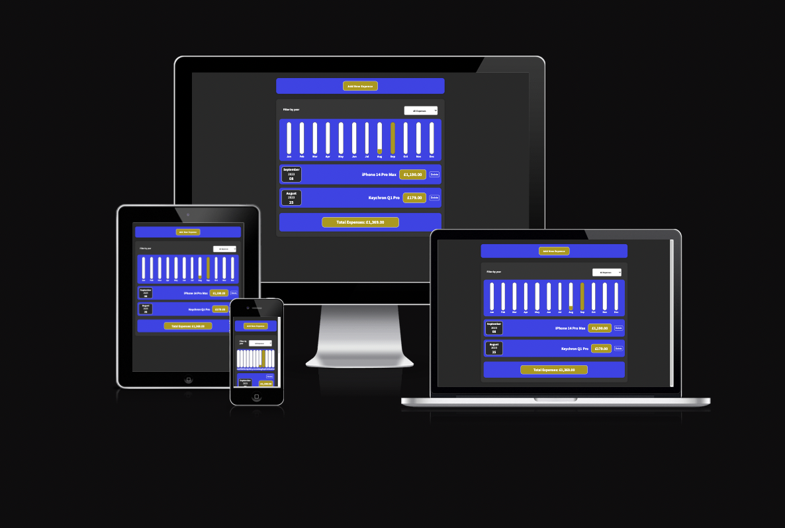

# Expenses Tracker

---

## Table of Contents

- [General Info](#general-info)
- [Live Version](#live-version)
- [Technologies](#technologies)
- [Features](#features)
- [Status](#status)
- [Contact](#contact)
- [License](#license)

## General Info

This simple tool allows users to track, visualize, and manage their yearly expenses over time.

## Live Version

The live version of the application can be accessed here: [Expenses Tracker Live](https://yearlyexpensestracker.netlify.app/)

## Technologies

The project is created with:

- React
- JavaScript
- CSS3
- LocalStorage for data persistence

## Features

The Expenses Tracker boasts several features and functionalities, including:

- **Expense Filtering**: Dynamic year-based expense filtering system.
- **Intuitive Form**: User-friendly form with validation and feedback.
- **Visual Representation**: Comprehensive chart visualization for monthly expenses.
- **Yearly Expenses Calculation**: Quick computation of the total expenses for the selected year.
- **Data Persistence**: Utilizing localStorage, user's data remains intact across sessions.
- **Expense Management**: Features like deleting expenses and listing them in a sorted manner (latest first) for easy tracking.

## Status

The project is complete and fully functional. Regular updates and improvements may be carried out in the future.

## Contact

Created by [Stoyan Peev](https://stoyanvisuals.com/)

Website - [stoyanvisuals.com](https://stoyanvisuals.com/)

Email - [info@stoyanvisuals.com](mailto:info@stoyanvisuals.com)

X / Twitter - [@stoyanvisuals](https://twitter.com/stoyanvisuals)

## License

This project is licensed under the MIT License. You're welcome to view, modify, and distribute the code as per the terms of the MIT License.

For more details, see the [MIT License](https://opensource.org/licenses/MIT).

[Back To The Top](#expenses-tracker)
